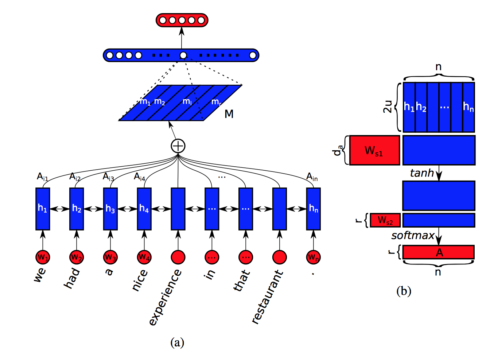
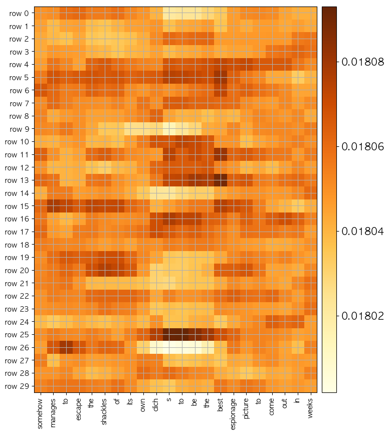
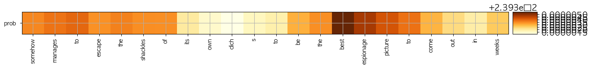

# A STRUCTURED SELF ATTENTIVE SENTENCE EMBEDDING
#### (This is a sentiment classification model for sentences. )  
  
#### cuteboydot@gmail.com    
  
#### reference  
1. [A STRUCTURED SELF ATTENTIVE SENTENCE EMBEDDING, Z Lin](https://openreview.net/pdf?id=BJC_jUqxe)  
  
#### data reference  
1. [polarity reviews](http://www.cs.cornell.edu/people/pabo/movie-review-data/)  
  
### 1. Self Attentive Model    
  
  
기존 attention의 shape은 [batch, seq]의 형태로 나오는데,  
self attentive 모델의 경우 row 단위를 확장하여 [batch, seq, rows] 형태를 갖는다.  
이때 rows 수 만큼의 독립적인 attention들이 서로 비슷한 모습 혹은 확률 분포를 갖는 경우가 생긴다.  
따라서 Frobenius norm을 이용하여 페널티 P = (A * AT − I)**2 를 loss에 더해준다.  
  
### 2. Test result   
    
  
    